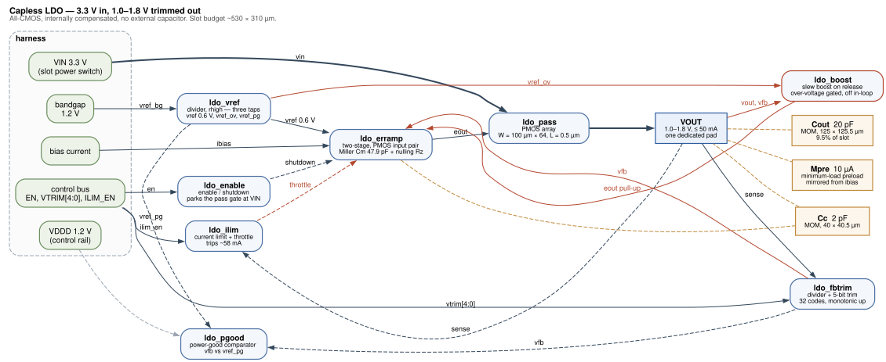

# sg13cmos5l_vyges_ip__ldo_capless

Capacitor-less (**capless**) low-dropout regulator (**LDO**) for the IHP
**SG13CMOS5L** process — **3.3 V in → digitally-trimmable ~1.0–1.8 V out** (default
1.2 V), internally compensated so it needs **no external or large on-chip
capacitor**. **All-CMOS** (PMOS pass device + error amp; no MiM cap — compensation
is MOM/poly), sized to a single openframe analog-slot footprint. Built for the
**Chipalooza Challenge #2 (IHP SG13CMOS5L)**.

> Status: **schematic**. The full cell hierarchy is captured in xschem, netlists, and
> simulates. See [`doc/implementation.md`](doc/implementation.md) for what is built and
> measured, and [`doc/proposal.md`](doc/proposal.md) for the original design intent.

## What it is

A clean, reusable local-supply regulator for sensitive analog/mixed-signal
blocks. Designed to drop into one openframe pallet slot: 3.3 V VIN from
the slot power switch, reference/bias from the harness V/I references, and
5-bit output trim over the digital control-status bus. A **4-wire (Kelvin) output**
keeps precision DC measurable through the shared analog mux.

Measured on the schematic hierarchy, tt/27 °C unless noted:

| Parameter | Measured | Specification |
| --- | --- | --- |
| Input | 3.0 – 3.6 V | 3.3 V nominal |
| Output, trimmed | 1.0007 – 1.7992 V, 32 monotonic codes | 1.0 – 1.8 V |
| Load | 0 – 50 mA | up to 50 mA |
| Line regulation | 0.38 mV/V | 5 mV/V max |
| Load regulation, 0→48 mA | 0.38 mV | 20 mV max |
| Phase margin, worst over load | 64.3° | 45° min |
| Phase margin, worst over PVT | 50.1° (ss/−40 °C) | 45° min |
| Output capacitor | **capless** — on-chip compensation only | no external cap |

| Current limit trip | 62.5 mA | 60 mA |
| Standby current, disabled | 3.19 µA | — |

Enable, power-good and current limit are implemented and exercised; see
[`doc/implementation.md`](doc/implementation.md). The block needs a 1.2 V control-bus
supply (`vddd`) alongside the 3.3 V rail.

## Layout

| Dir | Contents |
| --- | --- |
| `xschem/` | schematics — `ldo_vref`, `ldo_erramp`, `ldo_pass`, `ldo_fbtrim`, `ldo_capless` |
| `doc/schematics/` | rendered SVGs of every cell, readable without opening xschem |
| `magic/` | analog layout |
| `netlist/` | extracted / simulation netlists |
| `sim/` | testbenches |
| `verilog/` | digital enable / trim / power-good wrapper (LibreLane) |
| `signoff/` | DRC / LVS / extract / STA reports |
| `doc/` | design notes, characterization |
| `prototype/ldo/` | feasibility netlist (`ldo.spice`) — stable capless loop demonstrated in-process |

## Toolchain

IHP open flow: **xschem / ngspice / magic / netgen / klayout** + **LibreLane**
for the digital wrapper. ngspice must support **OSDI v0.4** (the IHP PSP103
models — SG13CMOS5L shares them with SG13G2) — use IIC-OSIC-TOOLS or
ngspice ≥ 43.

[**Vyges Loom**](https://vyges.com/products/loom) provides independent sign-off
alongside it — `vyges loom meas` measures the loop phase margin, `vyges loom lvs`
gates connectivity against a known-good netlist, and `vyges loom extract` supplies
parasitics once there is layout. Each exits non-zero on a violation, so they run as
build gates. Install: <https://docs.vyges.com/installation.html>. Commands and
results are in [`doc/implementation.md`](doc/implementation.md).

## Reproducing the results

`sim/run.sh` netlists the schematic hierarchy and runs every testbench from a clean
clone. It needs xschem, ngspice and the `ihp-sg13cmos5l` PDK at `/foss/pdks`.

Apache-2.0. See [`NOTICE`](NOTICE) for attribution.
