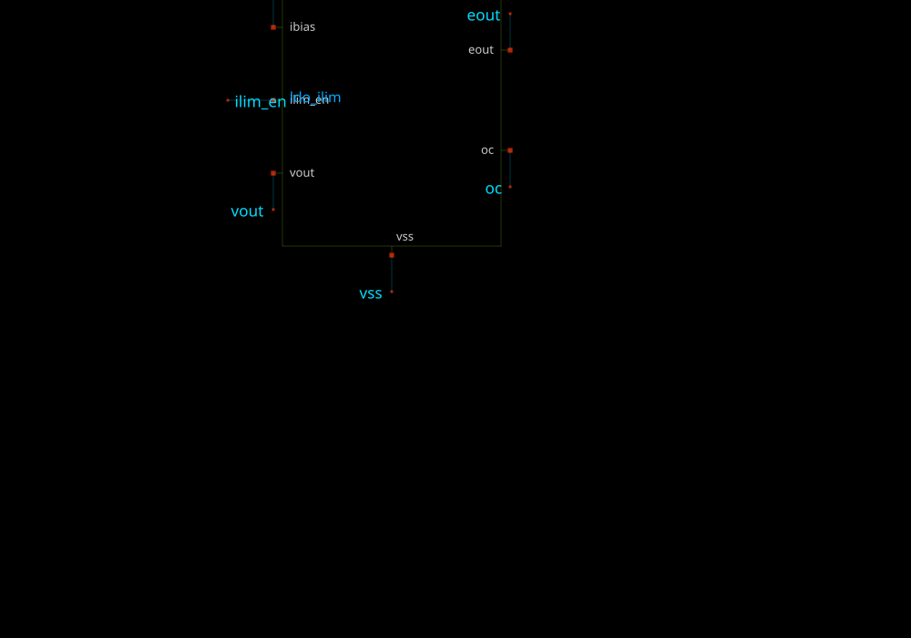

# ldo_capless

- Description: Capacitor-less LDO for IHP SG13CMOS5L, 3.3 V in, trimmable 1.0-1.8 V out
- PDK: ihp-sg13g2

## Authorship

- Designer: Vyges
- License: Apache 2.0
- Company: None
- Created: None
- Last modified: None

## Pins

- vin
  + Description: Input supply, 3.3 V nominal
  + Type: power
  + Direction: inout
  + Vmin: 3.0
  + Vmax: 3.6
- vout
  + Description: Regulated output (Kelvin sensed)
  + Type: signal
  + Direction: output
- vss
  + Description: Ground
  + Type: ground
  + Direction: inout
- vddd
  + Description: 1.2 V control-bus supply
  + Type: power
  + Direction: inout
- vref_bg
  + Description: Bandgap reference input
  + Type: signal
  + Direction: input
- ibias
  + Description: Bias current input from the harness
  + Type: signal
  + Direction: input
- en
  + Description: Enable
  + Type: signal
  + Direction: input
- ilim_en
  + Description: Current-limit enable
  + Type: signal
  + Direction: input
- pgood
  + Description: Power-good status
  + Type: signal
  + Direction: output
- oc
  + Description: Over-current status
  + Type: signal
  + Direction: output
- vtrim0
  + Description: Output trim bit 0 (LSB)
  + Type: signal
  + Direction: input
- vtrim1
  + Description: Output trim bit 1
  + Type: signal
  + Direction: input
- vtrim2
  + Description: Output trim bit 2
  + Type: signal
  + Direction: input
- vtrim3
  + Description: Output trim bit 3
  + Type: signal
  + Direction: input
- vtrim4
  + Description: Output trim bit 4 (MSB)
  + Type: signal
  + Direction: input

## Default Conditions

- vin
  + Description: Input supply voltage
  + Display: Vin
  + Unit: V
  + Typical: 3.3
- temperature
  + Description: Ambient temperature
  + Display: Temp
  + Unit: C
  + Typical: 27
- mos_corner
  + Description: MOS process corner
  + Display: MOS
  + Typical: mos_tt
- res_corner
  + Description: Resistor process corner
  + Display: RES
  + Typical: res_typ

## Symbol

## Schematic

