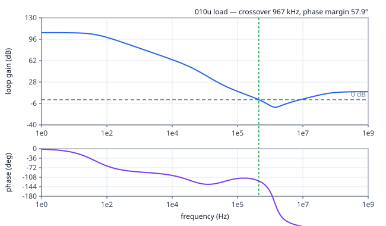
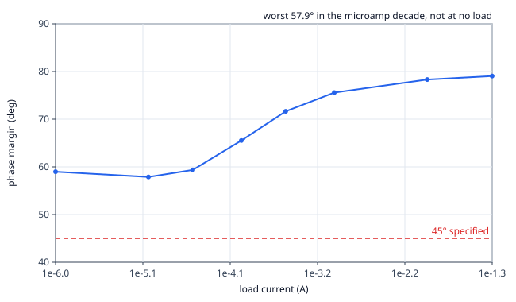
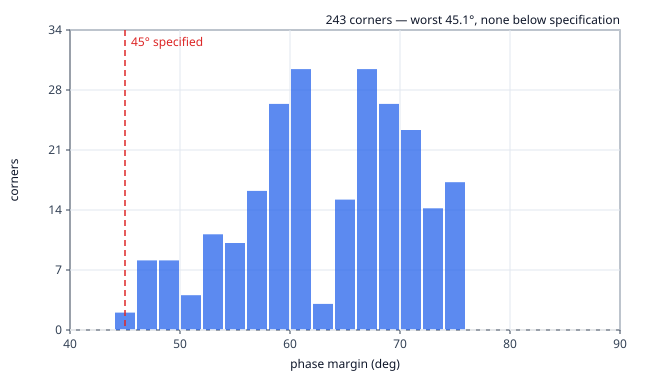
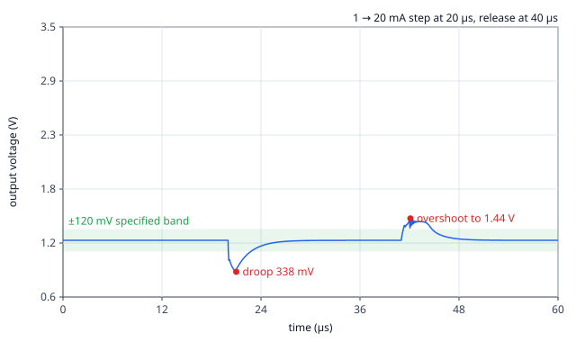
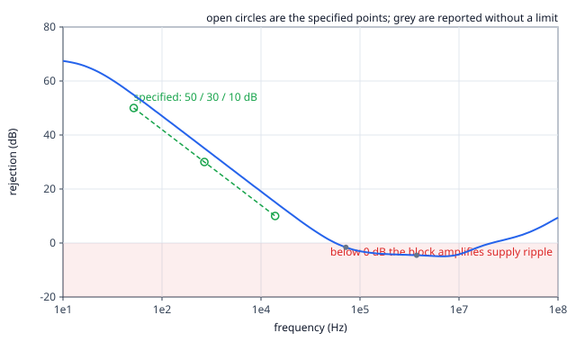
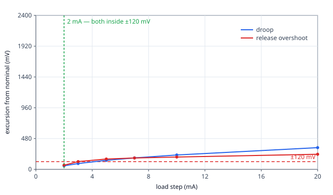

# Datasheet for ldo_capless

**netlist source**: schematic

| Parameter | Unit | Min Limit | Min Value | Typ Value | Max Limit | Max Value | Status |
| :-------- | :--- | --------: | --------: | --------: | --------: | --------: | :----: |
| Output voltage, mid code | V | 1.100 V | 1.208 V | 1.209 V | 1.300 V | 1.214 V | Pass ✅ |
| Output trim range, low code | V | any | 1.000 V | 1.000 V | 1.050 V | 1.000 V | Pass ✅ |
| Output trim range, high code | V | 1.750 V | 1.797 V | 1.797 V | any | 1.797 V | Pass ✅ |
| Line regulation | mV/V | any | 0.382 mV/V | 0.382 mV/V | 5.000 mV/V | 0.382 mV/V | Pass ✅ |
| Load regulation, 0-48 mA | mV | any | 0.270 mV | 0.270 mV | 20.000 mV | 0.270 mV | Pass ✅ |
| Dropout at 50 mA | mV | any | 149.736 mV | 149.736 mV | 250.000 mV | 149.736 mV | Pass ✅ |
| Quiescent current, enabled | uA | any | 37.080 uA | 41.533 uA | 60.000 uA | 44.837 uA | Pass ✅ |
| Current limit trip | mA | any | 58.499 mA | 58.499 mA | 60.000 mA | 58.499 mA | Pass ✅ |
| Phase margin over PVT | deg | 45.000 deg | 45.097 deg | 64.842 deg | any | 74.716 deg | Pass ✅ |
| PSRR at 100 Hz | dB | 50.000 dB | 54.865 dB | 54.865 dB | any | 54.865 dB | Pass ✅ |
| PSRR at 1 kHz | dB | 30.000 dB | 35.067 dB | 35.067 dB | any | 35.067 dB | Pass ✅ |
| PSRR at 10 kHz | dB | 10.000 dB | 15.118 dB | 15.118 dB | any | 15.118 dB | Pass ✅ |
| Supply rejection holds below | kHz | any | 71.415 kHz | 71.415 kHz | any | 71.415 kHz | Pass ✅ |
| Load-step droop at 19 mA/us | mV | any | 338.241 mV | 338.241 mV | any | 338.241 mV | Pass ✅ |
| Load slew rate for 120 mV droop | mA/us | 1.000 mA/us | 2.649 mA/us | 2.649 mA/us | any | 2.649 mA/us | Pass ✅ |
| Load-release overshoot | mV | any | 235.610 mV | 235.610 mV | 120.000 mV | 235.610 mV | Fail ❌ |
| Load step meeting ±120 mV | mA | 1.000 mA | 2.000 mA | 2.000 mA | any | 2.000 mA | Pass ✅ |
| Area | um2 | any | ​ | ​ | 164300.000 um2 | ​ | Skip 🟧 |
| Magic DRC | - | any | ​ | ​ | 0.000 | ​ | Skip 🟧 |
| Netgen LVS | - | any | ​ | ​ | 0.000 | ​ | Skip 🟧 |
| KLayout DRC | - | any | ​ | ​ | 0.000 | ​ | Skip 🟧 |
| Antenna violations | - | any | ​ | ​ | 0.000 | ​ | Skip 🟧 |

## Plots

### Loop gain and phase at the binding load

### Phase margin across the load range

### Phase margin over 243 PVT corners

### Load-step response — where both failures live

### Power-supply rejection against frequency

### Droop and overshoot against load-step size — where the promise can be set

---

© 2026 Vyges (https://vyges.com) · generated by `tools/datasheet.py`, do not edit by hand
